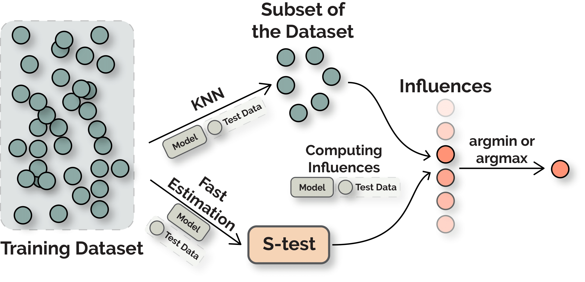

# FastIF: Scalable Influence Functions for Efficient Model Interpretation and Debugging

[Link to the Paper](https://arxiv.org/abs/2012.15781)



# Requirements
Please see `requirements.txt` and `Dockerfile` for detailed dependencies. The major ones include
- `python 3.6 or later` (for type annotations and f-string)
- `pytorch==1.5.1`
- `transformers==3.0.2`

# Setup
### Docker Setup
To build the docker image, run the following script.

```bash
DOCKER_BUILDKIT=1 docker build \
    -t ${TAG} \
    -f Dockerfile .
```

### Data Setup
1. Download the data following the examples from [here](https://github.com/huggingface/transformers/tree/master/examples/text-classification) and [here](https://github.com/huggingface/transformers/tree/master/examples/adversarial).
2. Mount the data into `/export/home/Data/Glue` and `/export/home/Data/HANS` inside the image.

# Experiments
1. To train the base models, please use `scripts/run_MNLI.sh` and `scripts/run_HANS.sh`.
2. To build FAISS indices, please see the function `create_FAISS_index` in `experiments/hans.py`.
3. Modify the paths in `experiments/constants.py` based on your setup.
4. To run the experiments, please follow the instructions in `run_experiments.py` where we have provided most of the default configurations/hyper-parameters.

# Code Structure

### `experiments/`
- This directory contains code that are used to conduct experiments.
- However, the entry-point for experiments is `run_experiments.py`.

### `influence_utils/`
This directory contains the core components of the influence functions. Most of the codes are designed to be independent of the experiments so could be adapted for others downstream needs. Two of the most important ones are:
- `influence_utils/nn_influence_utils.py` contains the code for influence functions.
- `influence_utils/parallel.py` contains the code for the parallel variant.
